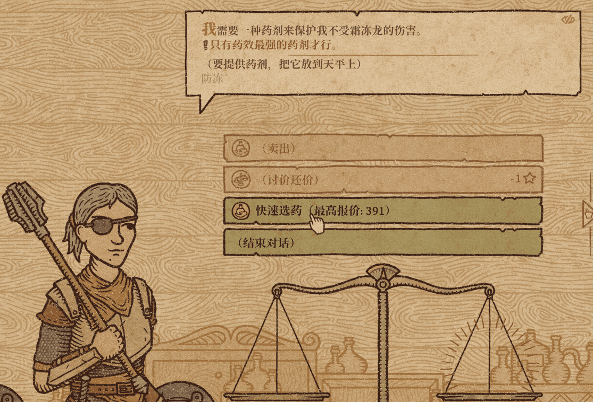

# Potion Craft Ukersn's Tweak Wizard
This Mod is compatible with Potion Craft v2.0.1.2!

**This plugin allows you to perform abnormal game operations, which may potentially lead to save file corruption or game crashes. Therefore, remember to backup your save files before using it.**

## Features:
> 1. Allow unrestricted planting of plants and crystals in the garden
> 
> *  (Default setting is true to enable, you can set EnableUnrestrictedPlanting to false in the configuration file to disable it)
>
> 2. Right-clicking on ingredients in your inventory while in the laboratory instantly grinds them to their fully ground state (this does not affect crystals). 
> 
> *  However, you can Shift + right-click to directly throw the fully ground ingredients into the cauldron (including crystals).
> 
> * (This feature is enabled by default with 'true'. You can set EnableOneClickGrinding to 'false' in the configuration file to disable it)
>
> 3. Disable particle effects in the game
> 
> * (Default setting is true to enable, you can set DisableParticleEffects to false in the configuration file to disable it)
> 
> * Turn this on to disable as many shiny effects as possible (such as crystals, decorations, etc.)
> 
> * This can improve frame rate by about 10%
>
> 4. Disable scratches effects on potions and NPCs
>
> *  (Default setting is false to disable, you can set DisableScratchesEffects to true in the configuration file to enable it)
>
> * Turn this on to disable Scratches effects on potions and NPCs as much as possible.
> 
> * It might look a bit strange, but it can improve frame rate by about 3%!
>
> 5. Potion edge snapping feature
>
> * (Default setting is false to disable, you can set EnablePotionEdgeSnapping to true in the configuration file to enable it)
>
> * (Default hotkey is Q, you can change it to other buttons in the PotionEdgeSnappingKey configuration in the configuration file)
>
> * When holding down the specified key, potions will automatically snap to the edge of the vortex when close, making positioning easier and more precise
>
> * The feature may become less precise or ineffective when the potion is moved too quickly.
>
> * It takes effect when the hotkey is pressed during operation, triggered when entering and leaving the vortex.
>
> * (This plugin feature is similar to the Alchemist's Assistant mod, so it's set to false by default)
>
> 6. Quick potion selection
>
> * (Default setting is true to enable, you can set EnableQuickPotionSelection to false in the configuration file to disable it)
>
> * Adds a new button in the regular customer and trader interface to quickly select a suitable potion from your inventory and place it on the scale
>
> * When providing potions to traders, it will select the cheapest potion from your inventory that meets the conditions.
>
> * When providing potions to regular customers, it will select the most expensive potion from your inventory that meets the requirements.
>
> * Displays the theoretical value of the most suitable potion for this customer on the button (may not be 100% accurate in some cases)
> 
> 
>
> 7. Single effect potion quick selection
>
> * (Default setting is false to disable, you can set EnableSingleEffectPotionSelection to true in the configuration file to enable it)
>
> * The quick potion selection feature will only choose the most valuable single-effect potion, without considering multi-effect potions
> 

# Installation Instructions
> * 1. Download and install [BepInEx_x64_5.4.22][0] from GitHub
> * 2. Extract Ukersn's TweakWizard.dll to the Potion Craft\BepInEx\plugins folder.

You can find the configuration file com.ukersn.plugin.TweakWizard.cfg in the "Potion Craft\BepInEx\config" directory after running the game for the first time to modify the configuration.

# My Other Projects
[Recipe Book Button Fix][1]: Used to fix a bug where, after playing the game for a long time, the clickable area of the recipe book button becomes larger, overlapping other buttons.

[Auto Garden][2] : Tired of the daily routine of watering plants and harvesting vegetables? Auto Garden is here to help. It can perform all the harvesting and watering actions in your garden for you.

[Potion Craft Game Save Error Fixer/Editor][3] : Used to fix game save errors (corrupted saves)

-----

# 药剂工艺 Ukersn的游戏调整优化
此Mod适配药剂工艺v2.0.1.2版本！

**这个插件会让你可以进行非正常游戏的操作，所以是有可能导致存档损坏或者游戏崩溃的，所以要记得备份存档再来使用喔**

## 功能: 
> 1.允许在花园无限制的种植植物和水晶
>
> *  (默认设置为true开启，可以在配置文件中设定EnableUnrestrictedPlanting为false来关闭它)
>
> 2.在实验室中右击背包中的原料时，可以将其瞬间研磨至完全研磨状态（对水晶无效）
>
> * 可以通过Shift+鼠标右击直接将完全研磨状态的原料投入坩埚（包括水晶）
>
> * (默认设置为true开启，可以在配置文件中设定EnableOneClickGrinding为false来关闭它)
>
> 3.关闭游戏粒子效果
>
> *  (默认设置为true开启，可以在配置文件中设定disableParticleEffects为false来关闭它)
>
> * 开启后，将尽可能关闭游戏中那些金光闪闪的效果（比如水晶，装饰品等）这可以提高约10%的帧数
>
> 4.关闭药水和NPC身上的磨损效果
> *  (默认设置为false关闭，可以在配置文件中设定disableScratchesEffects为true来开启它)
>
> * 开启后，将尽可能关闭游戏中在药水和NPC身上的磨损效果
>
> * 看起来可能有点怪怪的，但它可以提高约3%的帧数！
>
> 5.药水贴边功能
> * (默认设置为false关闭，可在配置文件中将EnablePotionEdgeSnapping 设为true来开启它)
>
> * (默认热键为 Q，可在配置文件中的 PotionEdgeSnappingKey 配置设置为其他按钮来更改)
>
> * 按住指定按键时，药水靠近旋涡边缘会自动贴边，使定位更容易和精确
>
> * 药水移动太快时，会使得功能不那么精准或失效。
>
> * 在操作时按下热键时生效，在进入旋涡和离开旋涡时触发。
>
> * (这个插件功能跟Alchemist's Assistant模组的功能类似，所以默认设置为false不开启它)
>
> 6.快速选药
> * (默认设置为true开启，可在配置文件中将EnableQuickPotionSelection 设为false来关闭它)
>
> * 在普通客人和交易者界面添加新按钮，一键从背包中选出符合要求的药水并放到天平上
>
> * 在为交易者提供药水时，会选择背包中最便宜的符合条件的药水。
>
> * 在为普通客人提供药水时，会选择背包中满足需求的最贵的药水。
>
> * 在按钮上显示理论上最符合客人需求的药水价值（某些情况下可能不够准确）
>
> 
>
> 7.单效果药水快速选择
> * (默认设置为false关闭，可在配置文件中将 EnableSingleEffectPotionSelection 设为true来开启它)
>
> * 快速选药功能只选择最有价值的单一效果药水，不考虑多效果药水
>

# 安装说明
> * 1. 在GitHub下载并安装 [BepInEx_x64_5.4.22][0]
> * 2. 将Ukersn's TweakWizard.dll解压到Potion Craft\BepInEx\plugins文件夹。

你可以在第一次运行游戏后在目录"Potion Craft\BepInEx\config"中找到配置文件com.ukersn.plugin.TweakWizard.cfg来修改配置

# 我的其他项目
[配方书按钮修复][1] :用于修复游戏游玩久后配方书按钮可点击区域变大，从而覆盖其他按钮的bug

[自动花园][2] : 厌倦每天日常浇花和收菜的生活了么？自动花园来了，它可以帮您完成花园中所有的收获和浇水的动作。

[Potion Craft 游戏存档错误修复器/编辑器][3]  ： 用于修复游戏存档错误(坏档)

[0]: https://github.com/BepInEx/BepInEx/releases
[1]: https://github.com/ukersn/PotionCraftOpenRecipeButtonFix
[2]: https://github.com/ukersn/PotionCraftAutoGarden
[3]: https://github.com/ukersn/Potion-Craft-Save-File-Error-Fixer-Editor

